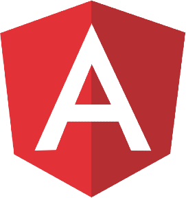

# Hi there, I'm Vincent Verboven 👋

## About me

- 📚 Full stack developer, preferring backend
- 🔬 Love to learn new things
- 🎧 Listen to music all the time
- 🏢 Currently working on building a company

### Projects
Some of the projects I've worked on are:
- [Jump](https://github.com/Meastro85/Jump): An attribute based DI framework for .NET
- [K10s](https://github.com/EliasDeHondt/K10s): A web UI for managing K8s clusters

### Connect with me!

[][linkedin]

 

### Tools and skills

<table style="border: 1px solid #ddd; border-collapse: collapse; padding: 8px;">
    <tr>
        <td style="border: 1px solid #ddd; padding: 8px;">Languages:</td>
        <td style="border: 1px solid #ddd; padding: 8px;">
            <a href="https://developer.mozilla.org/en-US/docs/Glossary/HTML5" target="_blank" rel="noopener noreferrer">
                 
            <!-- | HTML5 -->
            </a>
            <a href="https://developer.mozilla.org/en-US/docs/Web/CSS" target="_blank" rel="noopener noreferrer">
                 
            <!-- | CSS3 -->
            </a>
            <a href="https://www.typescriptlang.org/" target="_blank" rel="noopener noreferrer">
                
            <!-- TypeScript -->
            </a>
            <a href="https://javascript.info/js" target="_blank" rel="noopener noreferrer">
                
            <!-- | JavaScript -->
            </a>
            <a href="https://docs.microsoft.com/en-us/dotnet/csharp/tour-of-csharp/" target="_blank" rel="noopener noreferrer">
                
            <!-- | C# -->
            </a>
            
            
        </td>
    </tr>
    <tr>
        <td style="border: 1px solid #ddd; padding: 8px;">Frameworks:</td>
        <td style="border: 1px solid #ddd; padding: 8px;">
            
            
            
            
            
            
        </td>
    </tr>
</table>

[linkedin]: https://www.linkedin.com/in/vincent-verboven/
